# SISTEMA AUTOMATIZADO DE CONTROL BIOAMBIENTAL Y CONECTIVIDAD INTELIGENTE PARA EL TRANSPORTE DE LARVAS EN TANQUES

Prototipo embebido basado en **ESP32 y FreeRTOS** para monitorear las condiciones
del agua durante el transporte de larvas de camarón. El sistema integra medición
local, control de actuadores, pantalla táctil, una interfaz web para teléfono o
computadora y telemetría remota mediante Ubidots.

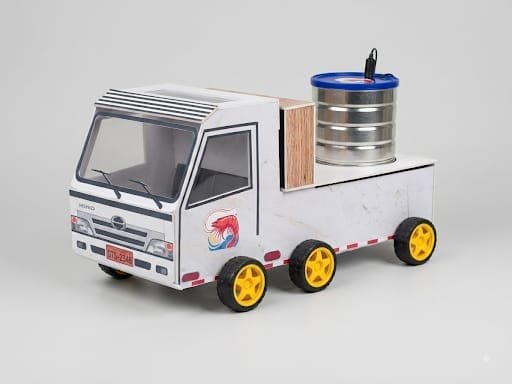

## Objetivo

Reducir el riesgo de mortalidad de las larvas durante el transporte mediante la
supervisión continua de temperatura y pH referencial, la actuación local sobre
una celda Peltier y una bomba, y el registro remoto de variables y eventos del
viaje.

## Funciones principales

- Medición de temperatura mediante un sensor DS18B20.
- Lectura referencial de pH a través de una entrada analógica.
- Control automático de la celda Peltier según la temperatura.
- Control manual de la bomba y la celda Peltier desde la pantalla o la interfaz web.
- Pantalla táctil TFT ILI9341 para operación local.
- Portal de configuración Wi-Fi con almacenamiento mediante `Preferences`.
- Interfaz web local accesible desde teléfono o computadora.
- Registro de origen, destino, tanque, inicio, finalización y duración del viaje.
- Telemetría MQTT hacia Ubidots con una cola local de 20 muestras.
- Atenuación y apagado automático de la iluminación de la pantalla.

## Arquitectura general

```text
Sensores de temperatura y pH
              |
              v
        ESP32 + FreeRTOS
        /      |       \
       v       v        v
 Pantalla   Actuadores  Wi-Fi/MQTT
   TFT      Peltier y   |       |
            bomba      Web    Ubidots
```

## Evidencias del prototipo

### Interfaz local en pantalla TFT

| Menú principal | Datos del sistema | Control automático |
|---|---|---|
| 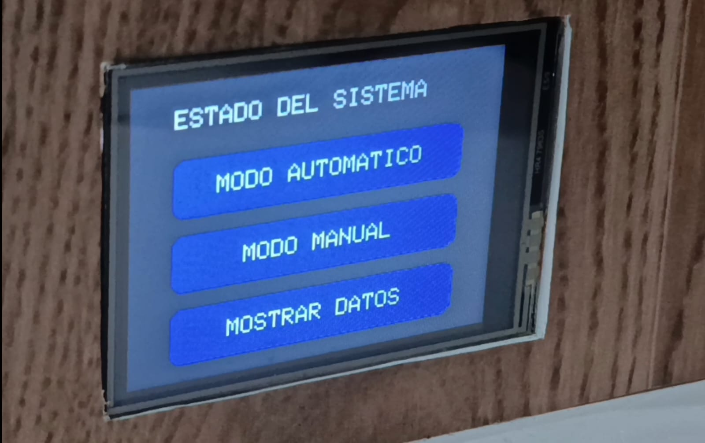 | 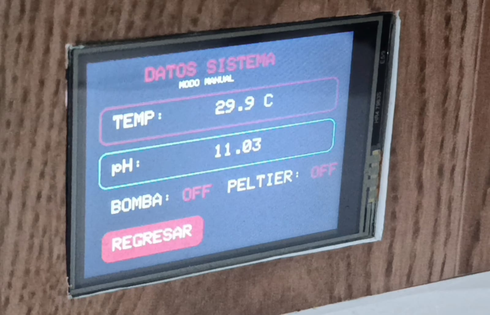 | 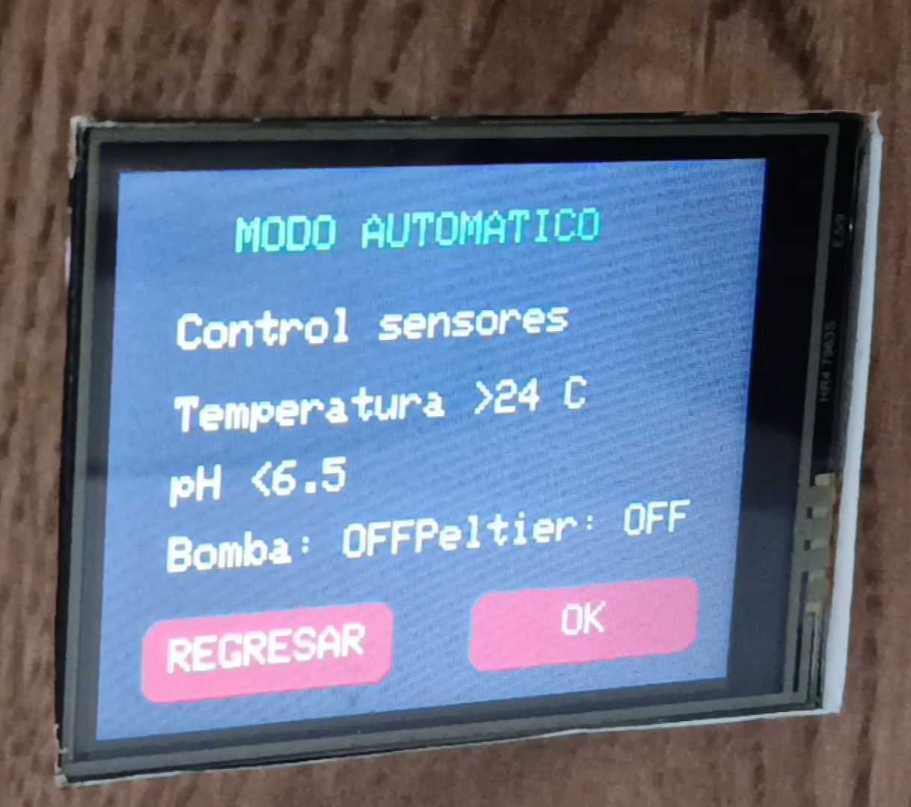 |

### Interfaz web desde una computadora

| Panel de monitoreo y control | Trazabilidad de un viaje |
|---|---|
| 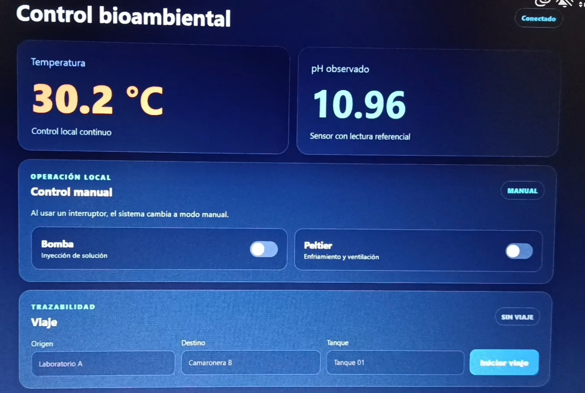 | 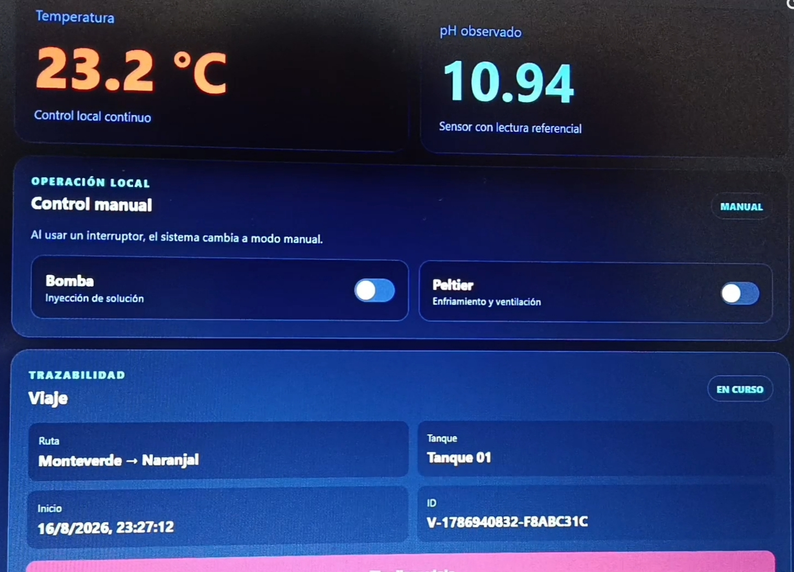 |

### Interfaz web adaptable para celular

| Monitoreo y control | Registro de un viaje | Viaje en curso |
|---|---|---|
| 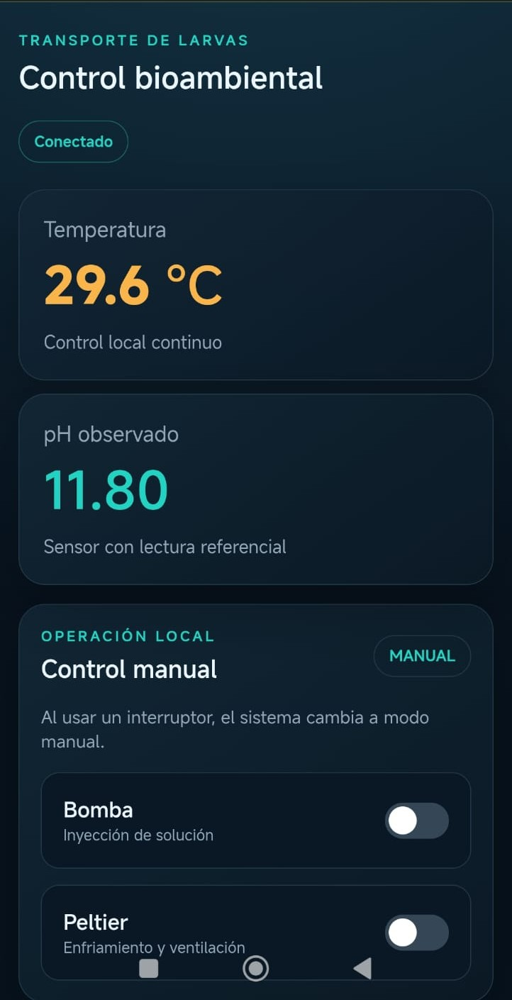 | 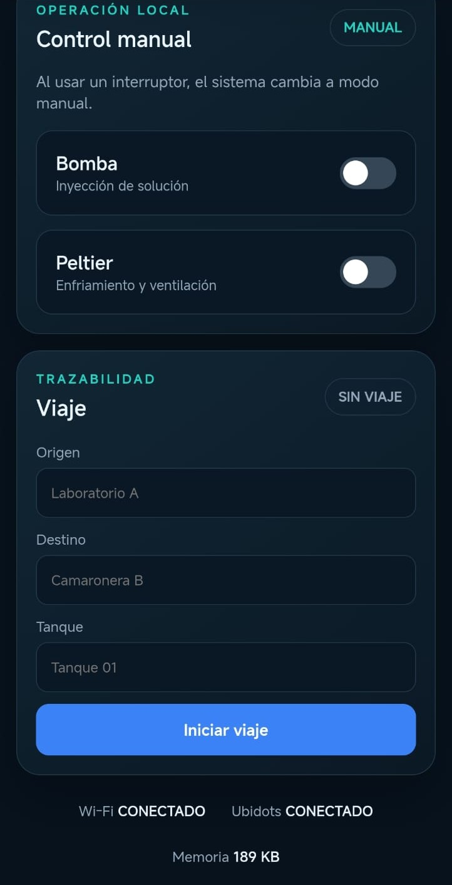 | 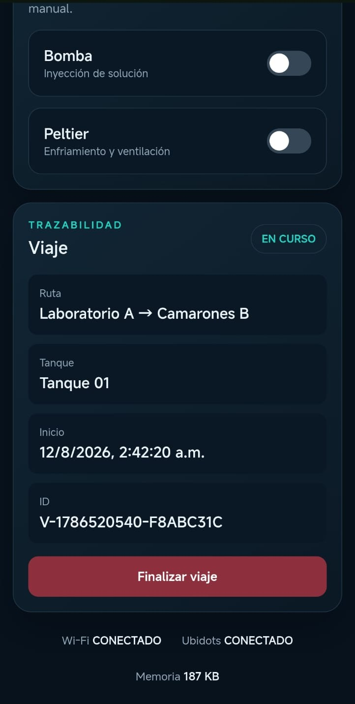 |

### Plataforma Ubidots

| Estado general | Gráficas del viaje |
|---|---|
| 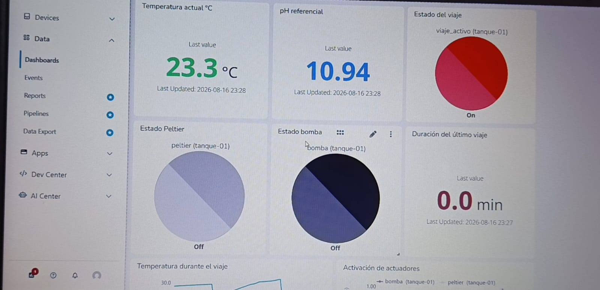 | 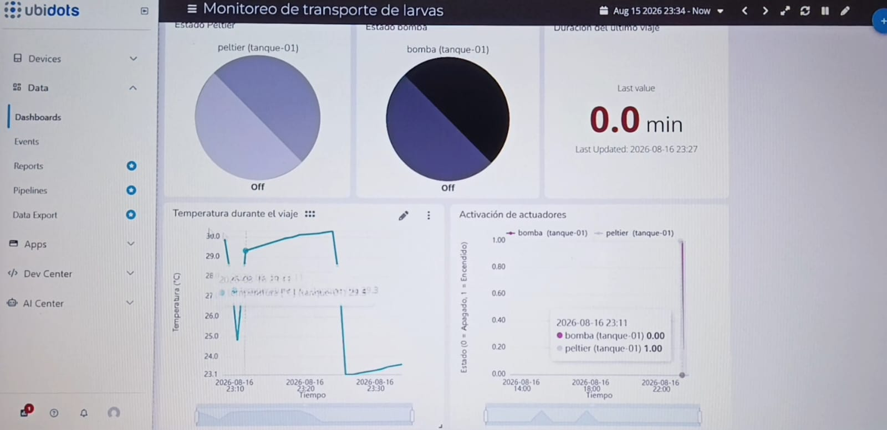 |

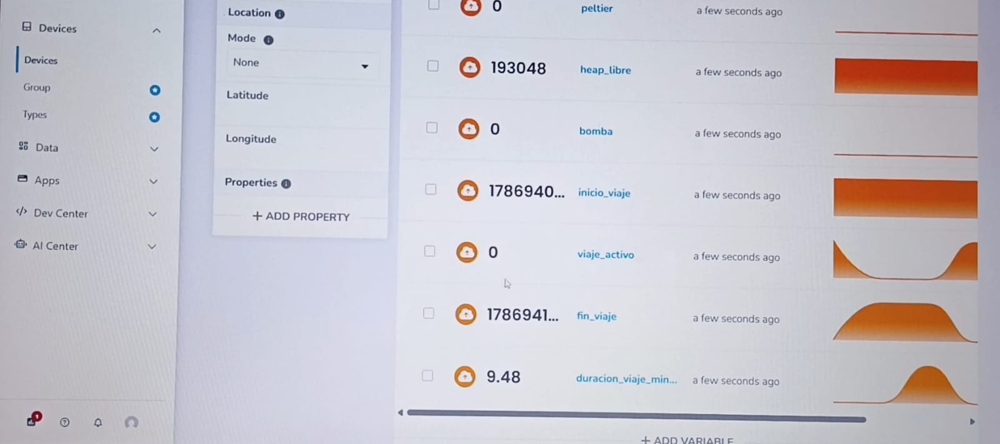

## Organización del proyecto

```text
.
|-- data/                 # Interfaz web almacenada en el ESP32
|-- docs/                 # Documento de diseño y evidencias gráficas
|   |-- DOCUMENTO_DE_DISENO.md
|   `-- imagenes/
|-- src/                  # Firmware del ESP32
|-- platformio.ini        # Configuración y dependencias
`-- README.md             # Documentación principal
```

## Documento de diseño

La versión corregida del documento académico, junto con sus diagramas de
contexto, bloques, estados e interfaces, está disponible en
[Documento de Diseño](docs/DOCUMENTO_DE_DISENO.md).

## Conexiones del ESP32

| GPIO del ESP32 | Conectado a | Terminal o señal | Función |
|---:|---|---|---|
| VIN / 5V | Regulador LM2596 | Salida de 5 V | Alimentación de la placa ESP32 |
| 3V3 | Sensor DS18B20 y lógica compatible | VCC | Alimentación de 3.3 V |
| GND | Todos los módulos | GND | Referencia eléctrica común |
| 4 | Sensor DS18B20 | DQ / DATA | Lectura digital de temperatura mediante One-Wire |
| 5 | Pantalla TFT ILI9341 | TFT_CS / CS | Selección de la pantalla en el bus SPI |
| 16 | Pantalla TFT ILI9341 | TFT_DC / DC | Selección entre datos y comandos |
| 17 | Pantalla TFT ILI9341 | TFT_RST / RESET | Reinicio de la pantalla |
| 18 | Pantalla ILI9341 y táctil XPT2046 | SCK y T_CLK | Reloj compartido del bus SPI |
| 19 | Pantalla ILI9341 y táctil XPT2046 | MISO/SDO y T_DO | Datos SPI desde los periféricos hacia el ESP32 |
| 23 | Pantalla ILI9341 y táctil XPT2046 | MOSI/SDI y T_DIN | Datos SPI desde el ESP32 hacia los periféricos |
| 25 | Controlador táctil XPT2046 | T_CS | Selección del controlador táctil |
| 26 | Módulo de relés | IN1, canal de la bomba | Encendido y apagado de la bomba de 12 V |
| 27 | Módulo de relés | IN2, canal Peltier | Encendido y apagado de la celda Peltier y su ventilador |
| 32 | Pantalla TFT ILI9341 | LED / BL | Control PWM de la retroiluminación |
| 34 | Módulo PH-4502C | PO / salida analógica | Lectura referencial de pH mediante el ADC |

El bus SPI es compartido por la pantalla y el controlador táctil; cada uno posee
su propia señal `CS`. El pin de interrupción `T_IRQ` del XPT2046 no se utiliza en
esta versión. El detalle de señales, alimentación y precauciones eléctricas se
encuentra en [Conexiones completas del ESP32](docs/CONEXIONES_ESP32.md).

## Esquemático electrónico y diseño PCB

El siguiente esquemático representa las conexiones del prototipo final con el
ESP32, el sensor DS18B20, el módulo PH-4502C, la pantalla táctil ILI9341 y el
módulo de relés.

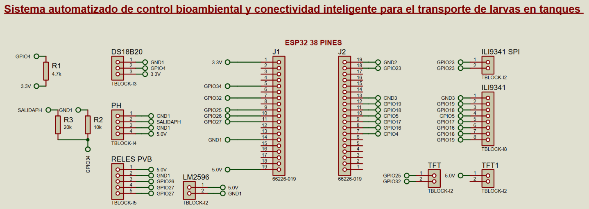

El diseño de la placa muestra la distribución de conectores y las pistas del
circuito impreso.

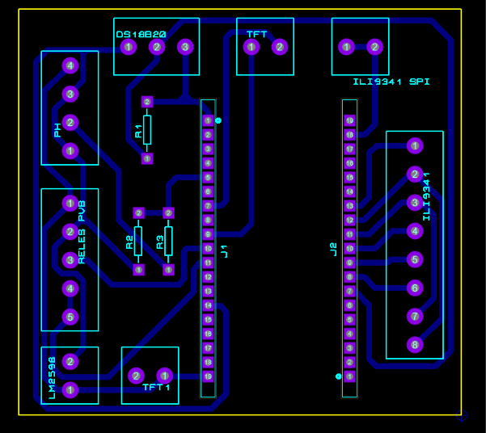

### Descarga del proyecto de Proteus

[**Descargar PCBCAMARONES.pdsprj**](docs/esquematico/PCBCAMARONES.pdsprj?raw=1)

El archivo contiene el esquemático y el diseño PCB. Para abrirlo se requiere
Proteus Design Suite.

## Requisitos

- Visual Studio Code con PlatformIO, o PlatformIO Core.
- Tarjeta ESP32 Dev Module.
- Librerías declaradas en `platformio.ini`.

## Configuración segura de Ubidots

Antes de compilar, editar en `src/telemetryManager.cpp`:

```cpp
constexpr char UBIDOTS_TOKEN[] = "CAMBIAR_TOKEN_UBIDOTS";
constexpr char DEVICE_LABEL[] = "tanque-01";
```

El token real no debe guardarse en un repositorio público. El prototipo utiliza
MQTT por el puerto 1883 para reducir el consumo de RAM y memoria Flash. Para una
implementación comercial se recomienda MQTT/TLS o un gateway seguro.

Variables publicadas: `temperatura`, `ph`, `bomba`, `peltier`, `modo_manual`,
`heap_libre`, `viaje_activo`, `evento_viaje`, `inicio_viaje`, `fin_viaje` y
`duracion_viaje_minutos`.

## Compilación y carga

Desde una terminal ubicada en esta carpeta:

```powershell
platformio run
platformio run --target uploadfs
platformio run --target upload
```

`uploadfs` carga la interfaz web y `upload` carga el firmware. Se debe verificar
el puerto configurado en `platformio.ini` antes de programar la tarjeta.

## Consideraciones de seguridad

- Regenerar el token de Ubidots antes de utilizar este código.
- Cambiar la contraseña predeterminada del punto de acceso para una instalación real.
- No publicar credenciales de redes Wi-Fi.
- Utilizar una red de confianza mientras MQTT funcione sin TLS.

## Autores

- **Edison Paulino Yagual Calapiña** - desarrollo, integración y documentación.
- **Anthony Santacruz** - colaboración en el desarrollo práctico del prototipo.

Este repositorio corresponde a la entrega individual de Edison Yagual. La fase
práctica del prototipo se realizó de manera colaborativa.
