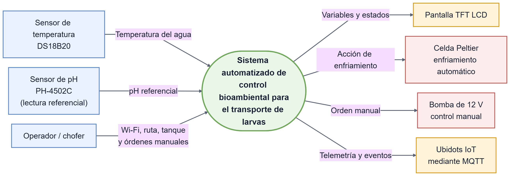
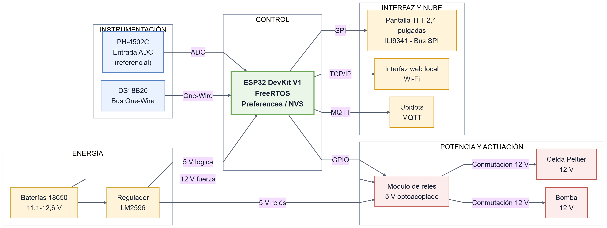
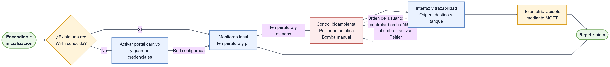
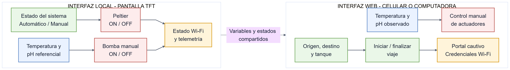

# Sistema automatizado de control bioambiental y conectividad inteligente para el transporte de larvas en tanques

**Autor:** Edison Paulino Yagual Calapiña 
**Carrera:** Ingeniería en Telemática 
**Correo:** epyagual@espol.edu.ec

## 1. Introducción

Este proyecto implementa un sistema embebido basado en el SoC ESP32 y el entorno multitarea FreeRTOS para reducir los riesgos asociados a las fluctuaciones térmicas durante el transporte terrestre de postlarvas de camarón. El dispositivo monitorea continuamente la temperatura y una lectura referencial de pH. El control automático en lazo cerrado se aplica a la temperatura mediante una celda Peltier, mientras que la bomba de 12 V se controla manualmente desde la pantalla táctil o la interfaz web. Además, el sistema transmite telemetría y eventos del viaje hacia Ubidots mediante MQTT y permite configurar credenciales Wi-Fi mediante un portal cautivo, almacenándolas con `Preferences` en la memoria NVS del ESP32.

## 2. Alcance y limitaciones

### ¿Qué se va a crear para cumplir los objetivos?

- Un nodo embebido central basado en el SoC ESP32, programado bajo el entorno multitarea FreeRTOS.
- Un subsistema de instrumentación compuesto por un sensor sumergible DS18B20 para temperatura y un módulo PH-4502C conectado al ADC para obtener una lectura referencial de pH, con aislamiento y acondicionamiento de señal analógica y digital.
- Un subsistema de actuación basado en relés optoacoplados para conmutar una celda Peltier y una bomba de 12 V. La celda Peltier se controla automáticamente según la temperatura y ambos actuadores pueden operarse manualmente.
- Una interfaz gráfica de usuario local (HMI) implementada sobre una pantalla TFT LCD de 2.4 pulgadas con controlador ILI9341 mediante bus SPI.
- Un firmware con portal cautivo en modo Access Point para almacenar credenciales Wi-Fi mediante `Preferences`/NVS, una interfaz web local para monitoreo y control, y comunicación MQTT con la plataforma Ubidots.

### ¿Qué problemas relacionados no se van a resolver?

- **Regulación química del agua:** el sistema presenta una lectura referencial de pH, pero no dosifica sustancias correctoras ni garantiza precisión de laboratorio. Tampoco corrige salinidad, amonio, nitritos u otras variables químicas.
- **Geolocalización perimetral satelital continua (GPS/GPRS):** el rastreo geográfico detallado o la transmisión celular en zonas sin cobertura Wi-Fi local o de la camaronera queda fuera del alcance de este prototipo inicial.
- **Fallas mecánicas o estructurales:** las fugas de agua, fracturas físicas en los tanques o fallos mecánicos del alternador del vehículo de transporte no serán diagnosticados ni mitigados por el sistema.
- **Condiciones ambientales y autonomía:** el prototipo puede verse afectado por humedad, radiación solar directa, bajas temperaturas, ventilación insuficiente del disipador y variaciones de alimentación. La autonomía no fue dimensionada para recorridos reales prolongados; una versión industrial requeriría encapsulado, protección eléctrica y cálculo energético.

## 3. Diagrama de contexto

Presenta las entradas, salidas y actores externos del sistema.

## 4. Diagrama de bloques del diseño

Muestra la conexión entre instrumentación, ESP32, actuadores, interfaces y Ubidots.

## 5. Diagrama de software o máquina de estados

Resume la inicialización, conexión, monitoreo, control y transmisión de telemetría.

## 6. Diagrama y diseño de interfaces

Presenta las funciones disponibles en la pantalla TFT y la interfaz web.

## 7. Alternativas de diseño

Para optimizar el hardware, se priorizó la robustez y la eficiencia económica mediante las siguientes decisiones:

- **Interfaz gráfica:** se rechazó la pantalla Nextion HMI (UART) en favor de una TFT LCD de 2.4 pulgadas con controlador ILI9341 (SPI). Esto redujo costos de adquisición y aprovechó el bus SPI nativo del ESP32 para un refresco gráfico eficiente gestionado directamente por el firmware.
- **Conmutación de fuerza:** se descartaron los MOSFET IRF520 debido a su elevada disipación térmica ante corrientes continuas altas, como las de la celda Peltier. Se seleccionó un módulo de relés de cuatro canales, 5 V y optoacoplado, que elimina pérdidas por conducción estática y brinda aislamiento galvánico frente a ruidos inductivos.
- **Gestión de red:** se rechazó la incorporación fija de parámetros en el código y se optó por almacenamiento dinámico no volátil en la memoria NVS mediante la biblioteca `Preferences`. Esto permite al operador modificar credenciales Wi-Fi mediante un portal cautivo ante cambios logísticos, sin requerir la reprogramación física del dispositivo.
- **Instrumentación de calidad del agua:** inicialmente se consideró un sensor de oxígeno disuelto, pero su costo y complejidad de adquisición excedían los recursos del prototipo académico. Se seleccionó un módulo PH-4502C como alternativa económica para obtener una referencia adicional del estado del agua. Debido a sus limitaciones de precisión, la lectura de pH no gobierna automáticamente la bomba.

## 8. Plan de pruebas y validaciones

### Pruebas sistemáticas de unidad

- **Validación de instrumentación térmica:** inmersión del sensor DS18B20 en entornos controlados de agua con hielo (0 °C) y agua en ebullición (100 °C) para calibrar la desviación por software respecto a un termómetro patrón certificado.
- **Validación del sensor de pH:** comparar las lecturas del PH-4502C con soluciones patrón para documentar su desviación y confirmar su uso únicamente como indicador referencial.

### Casos de prueba específicos de integración

- **Prueba de control térmico:** elevar la temperatura del agua por encima de 24 °C y comprobar la activación de la celda Peltier y su ventilador. Al regresar al rango establecido, verificar su desactivación.
- **Prueba de conectividad y telemetría:** iniciar el sistema sin redes conocidas, comprobar el despliegue del Access Point y registrar nuevas credenciales. Posteriormente, verificar desde un teléfono el monitoreo, el control manual y el registro de un viaje, y confirmar la recepción de datos y eventos en Ubidots.

## 9. Consideraciones éticas y de impacto

### Análisis de impacto en la sociedad

El sistema incorpora monitoreo y control automatizado al transporte de larvas, reduciendo la dependencia de procedimientos manuales y promoviendo el uso de tecnología local en el sector acuícola ecuatoriano.

### Problemas éticos y dilemas encontrados

- **Privacidad de las rutas:** la transmisión hacia Ubidots mediante MQTT sin TLS podría exponer el origen, el destino, los horarios y los identificadores del viaje si el canal o las credenciales fueran comprometidos.
- **Credenciales almacenadas:** el acceso no autorizado a las credenciales Wi-Fi guardadas en el ESP32 representa un riesgo para las redes de las empresas involucradas.

### Medidas implementadas y recomendaciones de seguridad

- **Seudonimización:** se utilizan identificadores de tanque y viaje en lugar de nombres. Esto reduce la exposición directa, pero no constituye cifrado ni impide analizar patrones.
- **Seguridad de las comunicaciones:** las credenciales se almacenan mediante `Preferences`/NVS. Una implementación real deberá cambiar la contraseña predeterminada, utilizar MQTT/TLS, rotar credenciales y aplicar controles de acceso.
